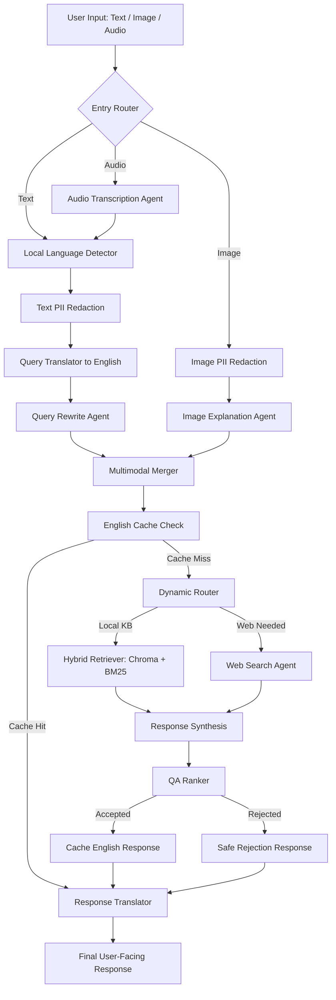

# Enterprise Multimodal RAG Engine for OSHA 29 CFR Part 1926

[]()
[]()
[]()
[]()
[]()

A multilingual, privacy-aware, multimodal Retrieval-Augmented Generation system for construction safety compliance analysis against **OSHA 29 CFR Part 1926**.

The system accepts **text, images, and audio**, normalizes multilingual user input into English, retrieves relevant OSHA context using hybrid search, generates a grounded safety-compliance response, validates the answer through a QA ranker, caches accepted English responses, and finally translates the validated answer back into the user's original language.

---

## Overview

Construction safety teams often need to evaluate complex job-site conditions against detailed OSHA regulations. Manual inspection and legal lookup can be slow, inconsistent, and difficult to scale.

This project demonstrates a production-inspired AI architecture for safety-compliance assistance:

- **Text input** for direct safety questions.
- **Image input** for visual job-site inspection.
- **Audio input** for voice-based safety queries or field notes.
- **PII redaction** before downstream model processing.
- **Multilingual handling** for Arabic, English, and other supported languages.
- **English-normalized retrieval and caching** for consistency.
- **Hybrid RAG retrieval** using dense vectors, sparse BM25, and reranking.
- **QA ranking and rejection fallback** to reduce unsupported compliance answers.

---

## Why This Project Matters

This system is designed around a realistic enterprise AI problem:

> Convert unstructured field data into reliable, evidence-grounded compliance guidance.

A field engineer may upload a photo of a scaffold, record a voice note in Arabic, or ask a written question in English. The system converts those inputs into a unified search payload, retrieves the relevant OSHA sections, and generates an answer that is grounded in retrieved regulatory context.

Although the demo domain is OSHA construction safety, the architecture is reusable for other enterprise domains such as:

- Customer-support conversation analytics.
- Arabic speech intelligence.
- Call-center QA and compliance monitoring.
- Internal policy assistants.
- Field-inspection copilots.
- Safety and legal knowledge-base assistants.

---

## Core Capabilities

### 1. Multimodal Input Handling

The system supports three input modalities:

| Modality | Purpose |
|---|---|
| Text | Direct user questions about OSHA safety conditions. |
| Image | Construction-site visual inspection and hazard description. |
| Audio | Voice questions, field notes, or spoken inspection observations. |

Audio is transcribed into text and then routed through the same privacy, translation, retrieval, ranking, caching, and response pipeline as written input.

---

### 2. Privacy-Aware Preprocessing

The system is designed to avoid unnecessary exposure of sensitive data.

Privacy layers include:

- Local language detection before LLM-based translation.
- Text PII redaction using Presidio.
- Image PII redaction using Presidio image redaction.
- English-only cache storage to avoid duplicate multilingual cache entries.
- Separation between internal English response and user-facing translated response.

For production Arabic PII handling, custom recognizers should be added for Arabic names, phone numbers, national IDs, addresses, and organization-specific identifiers.

---

### 3. Multilingual Query Layer

The system uses a language-normalized architecture:

```text
User query in Arabic / English / other language
        ↓
Local language detection
        ↓
PII redaction
        ↓
Translation to canonical English
        ↓
OSHA retrieval and reasoning in English
        ↓
QA ranking in English
        ↓
Final translation to the user's original language
```

This keeps retrieval, ranking, and caching consistent while allowing multilingual users to interact naturally.

---

### 4. English-Only Semantic Caching

The cache stores only:

```text
cache_key   = English merged retrieval query
cache_value = English grounded response
```

The translated final response is not cached.

This prevents duplicated cache entries across languages. For example, Arabic, English, and French versions of the same safety question can map to one English canonical query and one cached English response.

---

### 5. Hybrid Retrieval

The retrieval layer combines:

- **Dense semantic retrieval** using Chroma and HuggingFace embeddings.
- **Sparse keyword retrieval** using persistent BM25.
- **Ensemble retrieval** to combine semantic and lexical matches.
- **Reranking** to select the most relevant OSHA sections.

This helps the system retrieve both semantically similar regulations and exact keyword/legal references.

---

### 6. QA Ranker and Rejection Fallback

After response generation, a QA ranker evaluates whether the answer is sufficiently grounded in the retrieved context.

If the answer passes:

```text
response → ranker accepted → cache English response → translate → user
```

If the answer fails:

```text
response → ranker rejected → safe fallback response → translate → user
```

Rejected responses are not cached.

---

## High-Level Architecture



---

## Agent Workflow

### Entry Routing

The graph routes input based on available state fields:

- `query` → language detection and text pipeline.
- `image_bytes` → image redaction and image explanation.
- `audio_bytes` → transcription, then text pipeline.
- Combined inputs → parallel processing before multimodal merge.

### Main Nodes

| Node | Role |
|---|---|
| `local_language_detector_agent` | Detects user language locally without sending raw text to an LLM. |
| `query_pii_agent` | Redacts sensitive text before translation. |
| `user_query_translator` | Converts cleaned query into precise English for retrieval. |
| `rewrite_agent` | Rewrites the English query into OSHA-optimized retrieval language. |
| `image_pii_agent` | Redacts sensitive visual information. |
| `image_exp_agent` | Produces structured visual safety analysis. |
| `audio_transcription_agent` | Converts voice input into transcript text. |
| `merging_agent` | Fuses text, audio transcript, and image analysis into one retrieval payload. |
| `check_cache_agent` | Checks English-only semantic cache. |
| `k_getter_use_web` | Chooses retrieval depth and whether web fallback is needed. |
| `hyb_retriver_agent` | Retrieves OSHA context using dense + sparse retrieval. |
| `web_scrapper_agent` | Retrieves external information when local context is insufficient. |
| `responser_agent` | Generates OSHA-grounded compliance response. |
| `ranker_agent` | Evaluates grounding quality and hallucination risk. |
| `caching_agent` | Stores accepted English query-response pairs only. |
| `rejection_response_agent` | Generates safe fallback when confidence is low. |
| `response_translator` | Translates validated English response to user language. |

---

## Repository Structure

```text
.
├── agents.py                 # LangGraph node functions and agent logic
├── workflow.py               # StateGraph construction and routing
├── models.py                 # State schema and structured output models
├── prompt.py                 # Centralized system and human prompts
├── chuncking.py              # OSHA document ingestion and indexing pipeline
├── datagraping.ipynb         # Data scraping / preparation notebook
├── requirements.txt          # Python dependencies
├── .env.example              # Environment variable template
├── main.py                   # Example runner
├── osha/                     # Local Chroma vector database
├── osha_sparse/              # Persistent BM25 index
└── parent_doc_store_backup.json
```

---

## Installation

```bash
git clone <repository-url>
cd osha-rag-engine

python -m venv rag_env
source rag_env/bin/activate  # Windows: rag_env\Scripts\activate

pip install -r requirements.txt
```

---

## Environment Variables

Create a `.env` file:

```bash
OPENAI_API_KEY=your_openai_api_key
PINECONE_API_KEY=your_pinecone_api_key
TAVILY_API_KEY=your_tavily_api_key
LANGCHAIN_API_KEY=your_langsmith_api_key
LANGCHAIN_TRACING_V2=true
LANGCHAIN_PROJECT=osha-multimodal-rag
```

Adjust these variables depending on which providers you enable.

---

## Data Ingestion

Run the ingestion pipeline after preparing `osha_raw_documents.json`:

```bash
python chuncking.py
```

Expected generated artifacts:

```text
./osha/                         # Chroma dense vector store
./osha_sparse/                  # Persistent BM25 sparse index
./parent_doc_store_backup.json  # Parent document mapping
```

---

## Running the Workflow

Example text query:

```python
from workflow import workflow

app = workflow()

result = app.run({
    "query": "Does a worker need fall protection while standing on this scaffold?",
    "chat_hist": []
})

print(result.get("native_response") or result.get("response"))
```

Example Arabic query:

```python
result = app.run({
    "query": "هل العامل محتاج حزام أمان وهو واقف على السقالة؟",
    "chat_hist": []
})
```

Example image input:

```python
result = app.run({
    "query": "Is this scaffold setup compliant?",
    "image_bytes": "<base64_encoded_image>",
    "chat_hist": []
})
```

Example audio input:

```python
result = app.run({
    "audio_bytes": "<base64_encoded_audio>",
    "audio_format": "mp3",
    "chat_hist": []
})
```

Example combined input:

```python
result = app.run({
    "query": "Please inspect this situation.",
    "image_bytes": "<base64_encoded_image>",
    "audio_bytes": "<base64_encoded_audio>",
    "audio_format": "wav",
    "chat_hist": []
})
```

---

## Example Output

```text
Safety Assessment

The retrieved OSHA context indicates that fall protection may be required depending on the scaffold height, platform type, and whether guardrails or a personal fall arrest system are present.

Relevant OSHA References:
- 29 CFR 1926.451
- 29 CFR 1926.501

Limitations:
The image or query does not provide enough detail to confirm platform height, guardrail condition, anchorage, or exposure level. A definitive compliance judgment requires clearer site measurements and visual confirmation.
```

---

## Evaluation Strategy

| Component | Suggested Metric |
|---|---|
| Retrieval | Recall@k, MRR, manual relevance score |
| Reranking | Top-k relevance improvement |
| Response grounding | Human compliance review, citation accuracy |
| QA ranker | Accepted/rejected accuracy |
| Multilingual layer | Translation fidelity, terminology preservation |
| Audio handling | Word error rate, transcript quality |
| Latency | End-to-end response time |
| Cache | Hit rate, cost reduction, repeated-query latency |

---

## Engineering Highlights

### Stateful LangGraph Orchestration

The workflow uses LangGraph to separate each reasoning stage into explicit nodes. This improves traceability, debugging, modularity, and future extension.

### Hybrid Search

The system combines semantic search and lexical search to improve retrieval quality for technical and legal content.

### Multimodal Reasoning

The final retrieval query can be created from:

- User text.
- Audio transcript.
- Image safety analysis.

This creates a richer context than text-only RAG.

### Language-Normalized Processing

All retrieval, ranking, and caching happen in English. Final localization is done only after validation.

### Rejection-Safe Response Handling

Low-confidence answers are not silently returned as authoritative. The system generates a safe fallback message and asks for more information.

---

## Relevance to Arabic Speech Intelligence and Intella

This project is directly adaptable to Arabic speech intelligence workflows.

For a call-center or enterprise conversation analytics system, the same architecture could be adapted as:

```text
Arabic customer call
        ↓
ASR transcript
        ↓
PII redaction
        ↓
Language normalization
        ↓
Knowledge-base retrieval
        ↓
Conversation analysis
        ↓
QA ranking
        ↓
Structured business insight
```

Possible adaptations:

- Arabic call summarization.
- Customer intent classification.
- Sentiment and complaint detection.
- Agent QA scoring.
- Policy-grounded response recommendations.
- Compliance monitoring for customer-support calls.

The OSHA domain is used as a safety-critical demonstration, but the architecture generalizes to Arabic-first enterprise AI systems.

---

## Limitations

This project is a production-inspired prototype, not a certified legal authority.

Known limitations:

- OSHA answers depend on the quality and completeness of retrieved context.
- Audio transcription quality affects downstream reasoning.
- Arabic PII support needs custom recognizers for production use.
- Image analysis may miss hazards if the image is unclear or incomplete.
- The QA ranker reduces hallucination risk but does not guarantee legal correctness.
- External web fallback should be controlled in regulated environments.

---

## Roadmap

Planned improvements:

- Add a Streamlit or FastAPI interface.
- Add unit tests for each LangGraph node.
- Add sample audio, image, and text demo cases.
- Add structured JSON output for compliance reports.
- Add Arabic-specific PII recognizers.
- Add multilingual embeddings or cross-lingual retrieval evaluation.
- Add dashboard for retrieved sections and ranker confidence.
- Add audio diarization for multi-speaker inspection notes.
- Add WER evaluation for audio transcription.
- Add Docker deployment.

---

## Safety and Legal Disclaimer

This system is designed to assist with OSHA-related information retrieval and safety analysis. It should not be used as a substitute for qualified safety professionals, legal counsel, or official OSHA determinations.

Final compliance decisions should be made by certified safety experts using complete site information and the latest applicable regulations.

---

