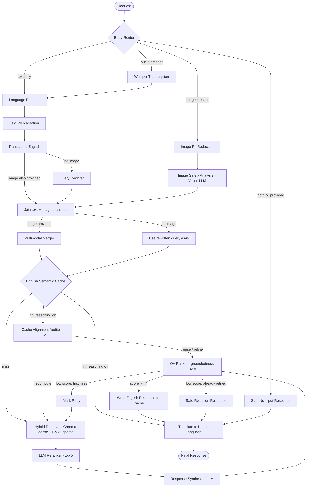

# Multilingual Multimodal RAG Engine for OSHA 29 CFR Part 1926

[]()
[]()
[]()
[]()
[]()
[]()
[]()

A production-shaped, privacy-aware, multilingual, multimodal **Retrieval-Augmented Generation** system that answers construction safety-compliance questions grounded in **OSHA 29 CFR Part 1926**, built as a portfolio piece to demonstrate how I design and implement real agentic AI systems end to end — orchestration, retrieval, safety, resilience, observability, and deployment.

The system accepts **text, images, and audio** in **Arabic, English, or French**, redacts PII before anything reaches a model, normalizes every input into canonical English for retrieval and caching, retrieves grounded OSHA evidence through a hybrid dense + sparse pipeline, generates and independently QA-scores a response, and finally translates the validated answer back into the user's own language.

---

## Why This Project

I built this to show, in one repository, how I approach the hard parts of shipping an LLM system rather than just calling a chat API:

- **Graph-based multi-agent orchestration** with explicit state, conditional routing, join points, and a bounded retry loop — not a single monolithic prompt.
- **Multi-provider LLM resilience**: every reasoning step tries a fast/cheap primary model and falls back to a secondary provider on failure, with recovery logic for provider-specific quirks (see [LLM Orchestration & Resilience](#llm-orchestration--resilience)).
- **Privacy-by-construction**: PII is redacted, in every supported language, *before* any text or image reaches a model — with a fail-closed default, not a fail-open one.
- **Language-normalized architecture**: retrieval, ranking, and caching all happen in one canonical language regardless of what language the user typed or spoke in.
- **Groundedness as a first-class citizen**: a dedicated QA ranker scores every answer before it is cached or shown, with a safe, transparent rejection path instead of a confident hallucination.
- **Operational maturity**: per-agent latency instrumentation, a fingerprinted/immutable embedding cache with fail-fast staleness checks, memory-tiered deployment configs, a multi-stage Docker build, and a real CI pipeline with functional, precision, and unit tests.

The OSHA domain is the demonstration surface. The architecture — audio/text/image ingestion → PII redaction → language normalization → hybrid retrieval → grounded generation → QA gating → localization — generalizes directly to other regulated, multilingual, evidence-grounded assistant use cases (compliance copilots, field-inspection assistants, policy Q&A, multilingual customer-support analytics).

---

## Core Capabilities

### 1. Multimodal Input Handling
Any combination of **text**, **image**, and **audio** can be submitted in a single request. The entry router (`models.py: entry_router`) inspects which fields are populated and activates exactly one text-side branch and one image-side branch per request — including the audio-plus-image and text-plus-audio-plus-image combinations — then joins them before retrieval.

### 2. Privacy-Aware Preprocessing (fail-closed)
- **Text PII redaction** via Microsoft Presidio (`AnalyzerEngine` + `AnonymizerEngine`), applied before translation, on both the typed query and the raw audio transcript.
- **Image PII redaction** via `presidio-image-redactor` (Tesseract OCR under the hood) — if the redactor engine isn't available or redaction raises, the image is **blocked from reaching the vision model entirely** rather than forwarded unredacted.
- A 4-tier coverage report (`presidio_en` / `presidio_multilingual` / `presidio_partial` / `fallback_regex`) is attached to every redaction so a caller always knows *how well* a given response was protected, not just that "something" ran.
- A conservative regex safety net (email, IBAN, credit card, SSN, phone) is the last line of defense if the Presidio engines are ever unavailable — the system never forwards raw, unredacted text.

### 3. Multilingual Query Layer
```text
User input (Arabic / English / French; text, audio, or both)
        ↓
Local, non-LLM language detection (lingua) — merges typed text + audio transcript
        ↓
PII redaction, in the source language
        ↓
Translation to canonical English
        ↓
OSHA retrieval, reranking, generation, and QA ranking — entirely in English
        ↓
Translation back to the user's original language (skipped if already English)
```
Retrieval, ranking, and caching are always keyed on the English-normalized query, so Arabic, English, and French phrasings of the same safety question converge on the **same cache entry and the same retrieval path**. See [Multilinguality: How It Works & How to Extend It](#multilinguality-how-it-works--how-to-extend-it) for the full detail and how to add another language.

### 4. Hybrid Retrieval, Trimmed by an LLM Reranker
1. **Hybrid Retriever** (`agents/Retrieve`): runs unconditionally over the *full* OSHA corpus — combining **dense semantic search** (Chroma + `sentence-transformers/all-MiniLM-L6-v2`) with **sparse BM25**, fused via a weighted `EnsembleRetriever` (0.6 dense / 0.4 sparse).
2. **LLM Reranker** (`agents/Reranker`): dedupes the retrieved evidence by `doc_id`, and — only when there are more than 5 candidate chunks — asks an LLM to select the most relevant before the responser sees them.

The corpus: **374 OSHA 29 CFR 1926 sections**, expanded into **5,818 subsection evidence chunks**, indexed as **6,192 dense vectors** and **5,818 BM25 documents**.

### 5. Two-Tier Semantic Caching
- **GPTCache**, keyed on the English-normalized merged query, for near-instant repeated-query latency.
- An optional **LLM cache-alignment auditor** (`cache_reasoner_agent`, toggled by `ENABLE_CACHE_REASONING`) that checks whether a cache *hit* actually still answers the *current* query before trusting it — semantic caches can match a near-duplicate rather than an identical past query, and this step decides to **reuse**, **refine**, or **discard and recompute** the cached answer instead of blindly returning it.

### 6. QA Ranker with a Bounded Retry Loop
Every generated answer is scored 0–10 for groundedness against the retrieved evidence. A score ≥ 7 is cached and returned. A low score gets **exactly one retry** — re-running hybrid retrieval — before the system gives up and returns a transparent, safe rejection message instead. Either way, it never silently loops forever, and never presents a low-confidence guess as authoritative.

### 7. LLM Orchestration & Resilience
- A provider-agnostic `Llm` factory (`agents/llm/llm_models.py`) wraps **Groq, OpenAI, Google Gemini, and local Ollama** behind one interface.
- A `FallBack` circuit-breaker (`agents/llm/fallback.py`) tries a primary router (Groq's `openai/gpt-oss-20b`, tuned for low latency/cost) and falls back to a secondary (`gpt-4o-mini`) on any failure — used consistently across the reranker, ranker, and cache auditor.
- Handles a real Groq interop edge case: on forced structured output, Groq can reject a response as `tool_use_failed` even when the model produced perfectly valid schema JSON as plain content — the fallback layer recovers that JSON from the error body instead of discarding a good answer (covered by a dedicated, fully-mocked unit test suite).
- Tunes Groq's `reasoning_effort` per call so `gpt-oss`'s hidden reasoning channel doesn't consume the entire token budget before the model writes its actual (schema-constrained) answer.

---

## Architecture


```mermaid
flowchart TD
    START([Request]) --> ROUTER{Entry Router}

    ROUTER -->|text only| LANG[Language Detector]
    ROUTER -->|audio present| AUDIO[Whisper Transcription]
    ROUTER -->|image present| IMGPII[Image PII Redaction]
    ROUTER -->|nothing provided| NOINPUT[Safe No-Input Response]

    AUDIO --> LANG
    LANG --> TEXTPII[Text PII Redaction]
    TEXTPII --> TRANS[Translate to English]
    TRANS -->|no image| REWRITE[Query Rewriter]
    TRANS -->|image also provided| JOIN
    REWRITE --> JOIN[Join text + image branches]

    IMGPII --> IMGEXP[Image Safety Analysis - Vision LLM]
    IMGEXP --> JOIN

    JOIN -->|image provided| MERGE[Multimodal Merger]
    JOIN -->|no image| SKIPMERGE[Use rewritten query as-is]

    MERGE --> CACHE{English Semantic Cache}
    SKIPMERGE --> CACHE

    CACHE -->|hit, reasoning off| RESPTRANS
    CACHE -->|hit, reasoning on| CACHEREASON[Cache Alignment Auditor - LLM]
    CACHE -->|miss| RETRIEVE[Hybrid Retrieval - Chroma dense + BM25 sparse]

    CACHEREASON -->|reuse / refine| RANKER
    CACHEREASON -->|recompute| RETRIEVE

    RETRIEVE --> RERANK[LLM Reranker - top 5]
    RERANK --> RESPOND[Response Synthesis - LLM]
    RESPOND --> RANKER[QA Ranker - groundedness 0-10]

    RANKER -->|score >= 7| CACHEWRITE[Write English Response to Cache]
    RANKER -->|low score, first miss| RETRY[Mark Retry]
    RETRY --> RETRIEVE
    RANKER -->|low score, already retried| REJECT[Safe Rejection Response]

    CACHEWRITE --> RESPTRANS[Translate to User's Language]
    REJECT --> RESPTRANS
    NOINPUT --> RESPTRANS
    RESPTRANS --> DONE([Final Response])
```

This graph is built with **LangGraph** (`workflow.py: Workflow.compile`) over a typed Pydantic `State` (`models.py`) shared by every node — 18 real agent/control nodes, conditional edges, and a bounded self-loop.

### Agent Reference

| Node (`workflow.py`) | Module | Role |
|---|---|---|
| `lang_detect` | `agents/LanguageDetector` | Local (non-LLM) language ID over typed text + audio transcript |
| `audio_trans` | `agents/Audio` | Speech-to-text via faster-whisper, with cloud fallback |
| `query_filter` / `image_filter` | `agents/PII` | Presidio-based text and image PII redaction |
| `user_trans` | `agents/QueryTranslator` | Translate cleaned query to canonical English |
| `query_rewriter` | `agents/Rewrite` | Rewrite into an OSHA-retrieval-optimized query |
| `image` | `agents/ImageAnalysis` | Vision-LLM structured safety analysis of an image |
| `merger` | `agents/Merger` | Fuse text + image analysis into one retrieval payload |
| `cache_check` / `caching` | `agents/Cache` | English-only semantic cache read/write (GPTCache) |
| `cache_reasoner` | `agents/Cache` | LLM audit of a cache hit's alignment with the live query |
| `retriever` | `agents/Retrieve` | Hybrid dense (Chroma) + sparse (BM25) retrieval over the full corpus |
| `reranker` | `agents/Reranker` | Dedupes retrieved evidence by `doc_id` and reranks down to the top-5 chunks |
| `responser` | `agents/Responser` | Grounded compliance-answer synthesis |
| `ranker` | `agents/Ranker` | Groundedness scoring + safe rejection fallback |
| `response_trans` | `agents/ResponseTranslator` | Translate the validated answer back to the user's language |

---

## Repository Structure

```text
.
├── agents/
│   ├── Audio/                # audio_transcription_agent + faster-whisper wrapper
│   ├── Cache/                # check_cache_agent, cache_reasoner_agent, caching_agent (GPTCache)
│   ├── ImageAnalysis/        # vision-LLM job-site safety analysis
│   ├── LanguageDetector/     # local (non-LLM) language identification
│   ├── Merger/                # multimodal query fusion
│   ├── PII/                   # Presidio text + image redaction (multilingual)
│   ├── QueryTranslator/       # source-language -> canonical English
│   ├── Ranker/                 # groundedness scoring + rejection fallback
│   ├── Reranker/               # LLM-based evidence reranking
│   ├── ResponseTranslator/     # English -> user's original language
│   ├── Responser/              # grounded answer synthesis
│   ├── Retrieve/               # hybrid Chroma + BM25 retrieval, embedding cache
│   ├── Rewrite/                # retrieval-query rewriting
│   ├── llm/                    # multi-provider chat model factory + fallback router
│   ├── helpers.py              # shared prompt/formatting utilities
│   └── prompt_registry.py      # runtime-editable prompt registry (backs the Streamlit Prompt Editor)
├── api/
│   ├── app.py                  # FastAPI entry point (lifespan PII warm-up, /health, router mount)
│   ├── endpoints.py             # per-agent + full-pipeline REST routes, auto-generated + timed
│   ├── workflow.py               # instrumented wrapper around workflow.Workflow (per-node latency)
│   └── schemas.py                 # StatePayload / PipelineRequest request models
├── scripts/
│   └── build_osha_embeddings.py  # offline step that (re)builds the committed embedding cache
├── parent_store/                  # OSHA section registry + corpus stats (retrieval source of truth)
├── cache/osha_chroma/               # pre-built, fingerprinted Chroma embedding cache (committed)
├── tests/                            # functional, precision, and unit test suites (pytest)
├── config.py                          # typed settings (pydantic-settings), reads .env
├── model_manager.py                    # local-directory-first model download/caching
├── models.py                            # shared LangGraph State schema + entry router
├── workflow.py                           # LangGraph StateGraph construction and routing
├── app_demo.py                            # Streamlit chat UI, API tester, live prompt editor
├── Dockerfile                              # multi-stage, CPU-only, Cloud Run-ready image
└── requirements.txt
```

---

## Tech Stack

| Layer | Technology |
|---|---|
| Orchestration | LangGraph (`StateGraph`), LangChain, LangSmith tracing |
| API | FastAPI + Uvicorn |
| Demo UI | Streamlit |
| LLM providers | Groq, OpenAI, Google Gemini, local Ollama (unified fallback layer) |
| Dense retrieval | ChromaDB + `sentence-transformers/all-MiniLM-L6-v2` (HuggingFace) |
| Sparse retrieval | BM25 (`rank_bm25` / `langchain_community`) |
| Semantic cache | GPTCache |
| Speech-to-text | faster-whisper (local, CTranslate2, int8, CPU), OpenAI Whisper API fallback |
| Language ID | `lingua-language-detector` (local, non-LLM) |
| PII redaction | Microsoft Presidio (analyzer + anonymizer + image redactor), `spacy-huggingface-pipelines` |
| PII multilingual NER | `Davlan/xlm-roberta-base-ner-hrl` transformer (Arabic) |
| Validation / schemas | Pydantic v2, `pydantic-settings` |
| Testing / CI | pytest, GitHub Actions |
| Deployment | Docker (multi-stage, CPU-only PyTorch), Streamlit Community Cloud, GitHub Codespaces |

---

## Running It Locally

### Prerequisites
- Python 3.12
- ~2–4 GB free disk for local models (embedding model, Whisper `small`, PII transformer) on first run
- API keys for at least one of Groq / OpenAI / Gemini (see below)
- On Linux/Codespaces: `tesseract-ocr` and `libgl1` system packages (already listed in `packages.txt`, used by both the Dockerfile and the devcontainer); on Windows, install the [Tesseract OCR](https://github.com/UB-Mannheim/tesseract/wiki) binary if you plan to exercise image PII redaction locally.

### 1. Clone and install
```bash
git clone https://github.com/ramhany-coder/Advanced-multi-model-Safety-Eng.-RAG-project.git
cd Advanced-multi-model-Safety-Eng.-RAG-project

python -m venv .venv
source .venv/bin/activate        # Windows (PowerShell): .venv\Scripts\Activate.ps1

pip install -r requirements.txt
```

### 2. Configure environment variables
Copy `.env.example` to `.env` and fill in at least one LLM provider key:
```text
GPT_API=                 # OpenAI API key (secondary/fallback model + Whisper cloud fallback)
GEMINI_API=               # Google Gemini API key
GROQ_API=                  # Groq API key (primary model for most agents)
OLLAMA_PATH=http://localhost:11434   # optional local inference
PARENT_PATH=chunks_1926.json
```
All other settings in `config.py` (embedding model, Whisper size, PII models, feature flags) have working defaults — no changes are required to run the app as-is.

### 3. Embedding cache
The pre-built OSHA embedding cache is already committed under `cache/osha_chroma/` — no build step is needed to run the app out of the box. Only rebuild it if you change `chunks_1926.json` (the file `PARENT_PATH` points to) or the embedding model:
```bash
python scripts/build_osha_embeddings.py
```
The app deliberately **fails fast** if the cache is missing or its fingerprint (a hash of the registry file + embedding model name) doesn't match — it will never silently re-embed the corpus at request time.

### 4. Run it
**Option A — Streamlit demo (recommended for a first run):**
```bash
streamlit run app_demo.py
```
This launches the full chat UI *and* boots the FastAPI backend automatically in a background thread — one command, nothing else to start.

**Option B — API only:**
```bash
uvicorn api.app:app --reload
```
Then hit `GET /health`, `GET /api/agents` (lists every individually-testable pipeline stage), or `POST /api/pipeline/run` with a JSON body of `{"query": "...", "image_bytes": null, "audio_bytes": null, "audio_format": null, "chat_hist": []}`.

The first request to touch each model (embedding, Whisper, PII) downloads it once to a local `models/` directory; every subsequent run loads it from disk with no network access.

---

## Multilinguality: How It Works & How to Extend It

Multilinguality is not bolted on as a translation step at the edges — it's a design constraint that shapes where every stage runs:

1. **Detection is local and free.** `agents/LanguageDetector/agent.py` uses `lingua-language-detector`, currently built for **Arabic, English, and French**, over a merge of the typed query *and* the audio transcript (so an audio-only Arabic message isn't silently misdetected as English just because `query` is empty — see `workflow.detect_language_from_available_text`).
2. **PII redaction happens in the source language, before translation** — never send raw personal data to a translation or reasoning model. English PII coverage is full NER (Presidio + spaCy); Arabic gets a dedicated multilingual transformer NER model (`Davlan/xlm-roberta-base-ner-hrl`); any other language falls back to language-agnostic pattern recognizers (email, phone, IBAN, credit card) since NER isn't reliable there. The coverage level actually used (`presidio_en` / `presidio_multilingual` / `presidio_partial` / `fallback_regex`) is returned alongside the redacted text, not hidden.
3. **Everything downstream of translation is language-agnostic.** Retrieval, reranking, generation, and QA scoring only ever see English, which keeps the vector index, BM25 index, and semantic cache single-language and consistent — an Arabic, English, or French phrasing of the same question hits the same cache entry.
4. **Localization happens exactly once, at the end**, and only if needed — `response_translator` is a pure pass-through when the detected language is already English, so no wasted LLM call on the common case.
5. **Whisper's own language detection feeds back into step 1**, so a spoken query's language is known even before any text-based detection runs.

**To add a new spoken/written language** (e.g. Spanish):
- Add it to `LanguageDetectorBuilder.from_languages(...)` in `agents/LanguageDetector/agent.py`.
- For real NER-based PII coverage in that language (not just pattern-based), add its code to `_MULTILINGUAL_LANGUAGES` in `agents/PII/helpers.py` — deliberately scoped to Arabic only today, because loading a second full transformer NER model alongside the English engine was verified to be memory-safe on an 8GB host, while loading *two* extra copies was verified to segfault under memory pressure. Scale this list against the RAM of your actual deployment target, not just "does it load once locally."
- No other agent needs to change — translation, retrieval, and generation already treat "the detected language" as a variable, not a hardcoded value.

Whisper transcription itself (`agents/Audio/whisper/whisper.py`) is language-agnostic by construction: `faster-whisper`'s `small` model auto-detects the spoken language per request; no per-language configuration is needed there.

---

## API Reference

| Method | Path | Purpose |
|---|---|---|
| `GET` | `/health` | Liveness check (used by the Docker `HEALTHCHECK`) |
| `GET` | `/api/agents` | Lists every pipeline stage that can be run in isolation |
| `POST` | `/api/agents/{stage-name}` | Runs one LangGraph node standalone against a partial state payload — useful for debugging or unit-style manual testing of a single agent |
| `POST` | `/api/pipeline/run` | Runs the full compiled graph end to end; returns the final state plus per-stage and total latency |

Every full-pipeline failure raises a structured error carrying **which** stage failed, how long it ran before failing, the latencies of every stage that completed before it, and the partial state — surfaced as an HTTP 500 with full diagnostic detail rather than a bare stack trace (`api/workflow.py: PipelineStageError`).

---

## Testing & CI

```bash
pytest -v
```

| Suite | What it verifies |
|---|---|
| `tests/test_retrieval.py` | Functional correctness of parent-document loading and the hybrid retriever's contract, **plus** Recall@k precision against a golden query set — run against the real embedding model and real BM25 index, no mocking |
| `tests/test_audio_pipeline.py` | Real faster-whisper transcription against committed English and Arabic audio fixtures, asserting a similarity ratio (not exact match, since STT output drifts slightly across model versions/hardware) |
| `tests/test_fallback.py` | The LLM fallback/circuit-breaker router — fully mocked, no API keys or network required, including the Groq `tool_use_failed` recovery path |

GitHub Actions (`.github/workflows/ci.yml`) runs the full suite on every push/PR to `main`: installs system dependencies from `packages.txt`, caches downloaded HF models between runs, and copies `.env.example` to `.env` so CI exercises the same default configuration a fresh clone would.

---

## Deployment

- **Docker**: a multi-stage `Dockerfile` builds against the CPU-only PyTorch wheel index (avoiding ~1.5 GB of unused CUDA/cuDNN packages on a GPU-less host), installs only the runtime system packages actually needed (`tesseract-ocr`, `libgl1` for image PII), and ships a container `HEALTHCHECK` against `/health`.
- **Streamlit Community Cloud**: the same `app_demo.py` runs there unmodified; `packages.txt` supplies the same system dependencies, and `config.py`'s `WARM_UP_PII_ON_STARTUP` / `ENABLE_MULTILINGUAL_PII` / `PII_SPACY_MODEL_NAME` flags let a memory-constrained free-tier host (~1 GB RAM) trade some PII accuracy for a footprint that actually fits, without touching any code.
- **GitHub Codespaces**: `.devcontainer/devcontainer.json` installs dependencies and auto-launches `streamlit run app_demo.py` on attach.

---

## Engineering Highlights

- **Immutable, fingerprinted retrieval cache.** The embedding cache is a build artifact, not a runtime side effect: it's fingerprinted by a hash of the source registry (normalized across CRLF/LF so a Windows build and a Linux deploy target agree) plus the embedding model name, and the app refuses to start against a stale or missing cache instead of silently re-embedding the corpus under production load.
- **Lazy, bounded, background model initialization.** Presidio's analyzer engines are constructed on a background thread the first time they're actually needed, with a bounded wait per call — a slow load doesn't block the request that triggered it, but also isn't given up on permanently; the next call picks up the finished engine.
- **Fail-closed privacy, not fail-open.** If a PII engine can't be confirmed working, redaction falls back to regex, and image redaction blocks the image outright rather than forwarding it unredacted to a vision model.
- **A retry loop that provably terminates.** The QA ranker's retry path is gated on a single `retried` flag in the shared state, guaranteeing at most one extra retrieval pass — re-running *both* parallel retrieval branches so the reranker's fan-in join is satisfied again — before falling through to a safe rejection; no risk of an unbounded agent loop.
- **Two retrieval strategies run unconditionally, not one gating the other.** An earlier version of this graph let the doc-ID mapper's confidence short-circuit the hybrid retriever. That traded recall for cost: a confident-but-wrong LLM section guess had no second opinion. The current graph fans out to both strategies on every cache miss and lets the reranker's join reconcile them — a deliberate recall-over-micro-optimization trade once the failure mode became visible.
- **Tolerant matching against a strict schema.** The doc-ID mapper's LLM occasionally answers with a paragraph-level citation (`1926.602(a)(9)`) instead of the requested base section ID. Rather than silently dropping an otherwise-correct match, `base_section_id()` normalizes it before validating against the known section registry.
- **Provider quirks handled explicitly, not papered over.** The Groq `tool_use_failed`-with-valid-JSON recovery path and the `reasoning_effort` tuning for `gpt-oss` models both exist because of concrete, observed failure modes — and both are covered by dedicated regression tests.
- **Per-agent observability without touching the graph.** `api/workflow.py` wraps every LangGraph node with a timer via `setattr` on the compiled `Workflow` instance's own attributes, so latency instrumentation is a pure decoration layer, not a change to `workflow.py`'s routing logic.
- **One codebase, two deployment tiers.** Config flags — not code branches — decide whether a deployment eagerly warms up every model at startup with full multilingual PII accuracy, or lazily loads a smaller footprint for a memory-constrained free-tier host.

---

## Limitations

This is a portfolio-grade, production-*shaped* prototype — not a certified compliance authority.

- Answer quality is bounded by what's actually retrieved; the doc-ID mapper's direct section lookup relies on the underlying LLM's own OSHA knowledge and can be wrong about which sections are relevant.
- Multilingual PII **NER** coverage is Arabic + English only today; other languages get pattern-based coverage (structured PII like emails/IDs) but not name/location detection — see [Multilinguality](#multilinguality-how-it-works--how-to-extend-it) for why, and how to extend it.
- `agents/llm/llm_models.py` supports routing to a local Ollama model, but `config.py`'s `Settings` doesn't yet declare an `OLLAMA_PATH` field to match `.env.example` — add it there before relying on the Ollama fallback path.
- Image analysis quality depends on image clarity; ambiguous or low-detail images degrade the grounded answer, which the QA ranker is designed to catch but cannot fully compensate for.
- This system assists with OSHA-related information retrieval and safety analysis; it is not a substitute for a certified safety professional, legal counsel, or an official OSHA determination.

---

## Author

**Ram Hany**

[LinkedIn](https://www.linkedin.com/in/ram-hany-96a34b35a) · [GitHub](https://github.com/ramhany-coder) · ramyhany5678@gmail.com

**Other projects:** [Drug Assistant Agent](https://github.com/ramhany-coder/Drug-assistant-agent) — another agentic AI system.

